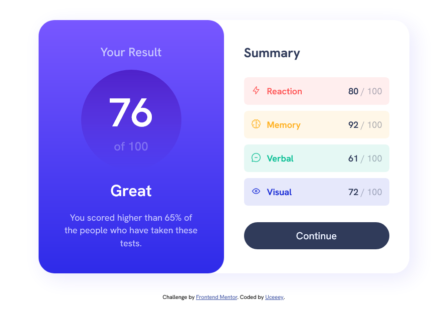

# Frontend Mentor - Results summary component solution

This is a solution to the [Results summary component challenge on Frontend Mentor](https://www.frontendmentor.io/challenges/results-summary-component-CE_K6s0maV).

## Table of contents

- [Overview](#overview)
  - [The challenge](#the-challenge)
  - [Screenshot](#screenshot)
  - [Links](#links)
- [My process](#my-process)
  - [Built with](#built-with)
  - [Useful resources](#useful-resources)
- [Author](#author)

### The challenge

Users should be able to:

- View the optimal layout for the interface depending on their device's screen size
- See hover and focus states for all interactive elements on the page

### Screenshot

### Links

- Solution URL: [Solution](https://your-solution-url.com)
- Live Site URL: [Live site](https://result-summary-page-uc.netlify.app/)

## My process

### Built with

- Semantic HTML5 markup
- CSS custom properties
- Flexbox
- CSS Grid
- Mobile-first workflow

### Useful resources

- [Google Fonts](https://fonts.google.com/)
- [Mozilla Developer Network](https://developer.mozilla.org/en-US/)

## Author

- LinkedIn - [Uchechi Nmecha](https://www.linkedin.com/in/uchechi-nmecha-15743421b)
- Frontend Mentor - [@UchechiNmecha](https://www.frontendmentor.io/profile/UchechiNmecha)
- Twitter - [@NmechaUchechi](https://www.twitter.com/NmechaUchechi)
